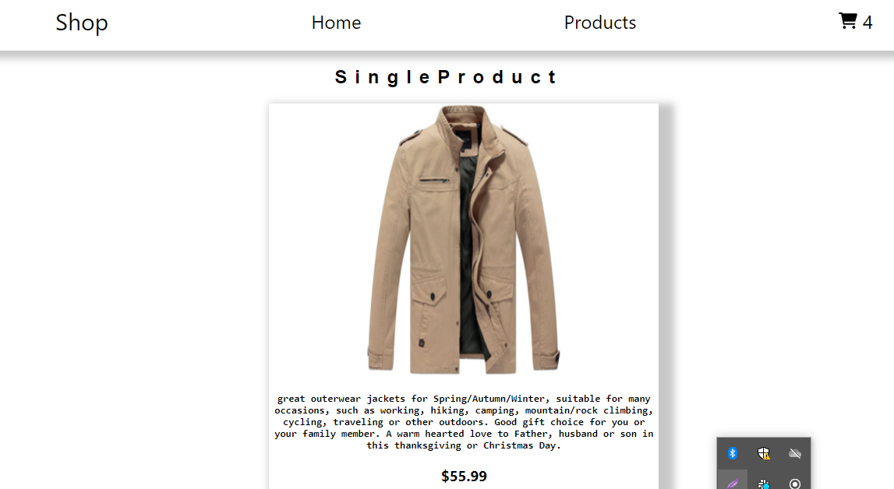

# Getting Started with Create React App

## Shop

### This is shop site where was used Fake Store API

url[https://fakestoreapi.com/]

### Source files

1. (assets)[./src/assets]
2. (components)[./src/components]
3. (function)[./src/function]
4. (requests)[./src/requests]
5. (utils)[./src/utils]
6. (App.js)[./App.js]
7. (index.js)[./index.js]

#### Home Page

---

#### Product Page

---

#### Single Product Page

