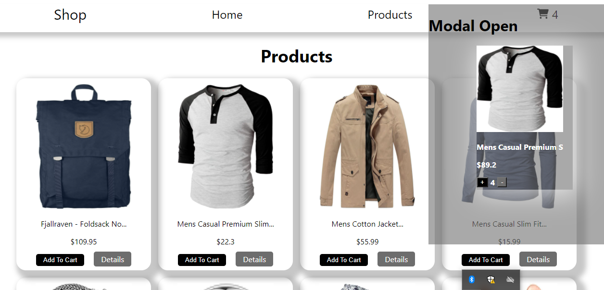

# Getting Started with Create React App

## Shop

### This is shop site where was used Fake Store API

url[https://fakestoreapi.com/]

### Source files

1. assets
2. components
3. function
4. requests
5. utils
6. App.js
7. index.js

#### Home Page

---

#### Product Page

---

#### Single Product Page

